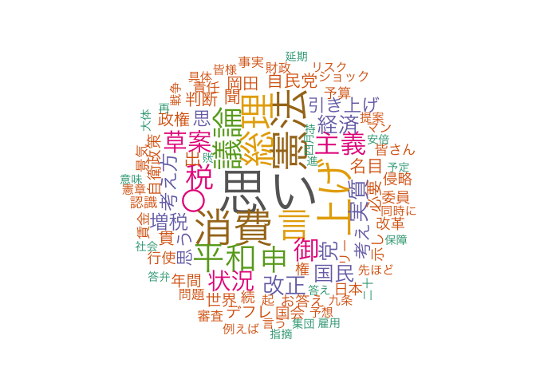

Japanese Language Demo by amatsuo
=================================

In this demo, I will show processing of Japanese Congressional Speech data through `quanteda` (and `kaigiroku`).

### Install `kaigiroku` package

This package is to access the API of Kokkai Kaigiroku, conference minutes of Japanese National Diet. The API documentation is available [here](http://kokkai.ndl.go.jp/api.html) (only in Japanese).

You can install a developer version by:

``` r
devtools::install_github("amatsuo/kaigiroku")
```

At the moment, the package provide only the functionality to download conference minutes of specific meetings (e.g. Budget Committee (予算委員会) and Plenary Meeting (本会議)) for a specified period.

Demo for [textworkshop2017](https://github.com/ropensci/textworkshop17)
-----------------------------------------------------------------------

### Download Conference Minutes

``` r
require(kaigiroku)
#> Loading required package: kaigiroku
# the following line will download all speeches at plenary meetings in the 
# Upper House (参議院) from Jan 1 to Jan 31, 2017. 
plenary_speeches <- get_meeting(house = "Upper", startDate = "2017-01-01", 
                                endDate = "2017-01-31", meetingName = "本会議")
#> Loading required package: XML
#> Loading required package: dplyr
#> 
#> Attaching package: 'dplyr'
#> The following objects are masked from 'package:stats':
#> 
#>     filter, lag
#> The following objects are masked from 'package:base':
#> 
#>     intersect, setdiff, setequal, union
#> 3 records found
#> Fetching, startingRecord = 1
#> Fetching, startingRecord = 3

# the following line will download all speeches at the budget committee meetings in 
# the lower house meetings
budgetcom_speeches <- get_meeting(house = "Lower", sessionNumber = 185, 
                                  meetingName = "予算委員会")
#> 4 records found
#> Fetching, startingRecord = 1
#> Fetching, startingRecord = 3

# the following line will download all speeches at the budget committee meetings in 
# the Prime Minister's Questions (or Party Leader Debate, "国家基本政策委員会合同審査会")
# qt_speeches are used in the later part of demos
qt_speeches <- get_meeting(house = "Both", sessionNumber = 190, 
                           meetingName = "国家基本政策委員会合同審査会")
#> 1 records found
#> Fetching, startingRecord = 1
head(qt_speeches)
#>   session nameOfHouse                nameOfMeeting issue       date
#> 1     190        両院 国家基本政策委員会合同審査会   1号 2016-05-18
#> 2     190        両院 国家基本政策委員会合同審査会   1号 2016-05-18
#> 3     190        両院 国家基本政策委員会合同審査会   1号 2016-05-18
#> 4     190        両院 国家基本政策委員会合同審査会   1号 2016-05-18
#> 5     190        両院 国家基本政策委員会合同審査会   1号 2016-05-18
#> 6     190        両院 国家基本政策委員会合同審査会   1号 2016-05-18
#>                                                            meetingURL
#> 1 http://kokkai.ndl.go.jp/SENTAKU/ryoin/190/9001/19005189001001a.html
#> 2 http://kokkai.ndl.go.jp/SENTAKU/ryoin/190/9001/19005189001001a.html
#> 3 http://kokkai.ndl.go.jp/SENTAKU/ryoin/190/9001/19005189001001a.html
#> 4 http://kokkai.ndl.go.jp/SENTAKU/ryoin/190/9001/19005189001001a.html
#> 5 http://kokkai.ndl.go.jp/SENTAKU/ryoin/190/9001/19005189001001a.html
#> 6 http://kokkai.ndl.go.jp/SENTAKU/ryoin/190/9001/19005189001001a.html
#>                                                              pdfURL
#> 1 http://kokkai.ndl.go.jp/SENTAKU/ryoin/190/9001/19005189001001.pdf
#> 2 http://kokkai.ndl.go.jp/SENTAKU/ryoin/190/9001/19005189001001.pdf
#> 3 http://kokkai.ndl.go.jp/SENTAKU/ryoin/190/9001/19005189001001.pdf
#> 4 http://kokkai.ndl.go.jp/SENTAKU/ryoin/190/9001/19005189001001.pdf
#> 5 http://kokkai.ndl.go.jp/SENTAKU/ryoin/190/9001/19005189001001.pdf
#> 6 http://kokkai.ndl.go.jp/SENTAKU/ryoin/190/9001/19005189001001.pdf
#>   speechOrder  speaker
#> 1           0         
#> 2           1 浜田靖一
#> 3           2 岡田克也
#> 4           3 安倍晋三
#> 5           4 岡田克也
#> 6           5 安倍晋三
#>                                                                                                                                                                                                                                                                                                                                                                                                                                                                                                                                                                                                                                                                                                                                                                                                                                                                                                                                                                                                                                                                                                                                                                                                                                                                                                                                                                                                                                                                                                                                                                                                                                                                                                                                                                                                                                                                                                                                                                                                                                                                                                                                                                                                                                                                                                                                                                                                                                                                                                                                                                                                                                                                                                                                                                                                                                                                                                                                                                                                                                                                                                                                                                                                                                                                                                                                                                                                                                                                                                                                                                                                                                                                                                                                                                                                                                                                                                                                                                                                                                                                                                                                                                                                                                                                                                                                                                                                                                                         speech
#> 1 平成二十八年五月十八日（水曜日）\n　　　　午後三時開議\n　　　　―――――――――――――\n委員氏名\n　　衆議院\n　　　委員長　浜田　靖一君\n　　　理事　小此木八郎君　理事　木村　太郎君\n　　　理事　田中　和徳君　理事　御法川信英君\n　　　理事　山口　泰明君　理事　今井　雅人君\n　　　理事　山井　和則君　理事　井上　義久君\n　　　　　　稲田　朋美君　　　　高村　正彦君\n　　　　　　佐藤　　勉君　　　　塩谷　　立君\n　　　　　　鈴木　俊一君　　　　園田　博之君\n　　　　　　棚橋　泰文君　　　　谷垣　禎一君\n　　　　　　二階　俊博君　　　　野田　聖子君\n　　　　　　細田　博之君　　　　松野　博一君\n　　　　　　茂木　敏充君　　　　安住　　淳君\n　　　　　　枝野　幸男君　　　　岡田　克也君\n　　　　　　高木　義明君　　　　太田　昭宏君\n　　　　　　志位　和夫君　　　　馬場　伸幸君\n　　　　　　小沢　一郎君\n　　参議院\n　　　委員長　北澤　俊美君\n　　　理事　関口　昌一君　理事　鶴保　庸介君\n　　　理事　小川　敏夫君　理事　羽田雄一郎君\n　　　　　　江島　　潔君　　　　太田　房江君\n　　　　　　岡田　直樹君　　　　堂故　　茂君\n　　　　　　羽生田　俊君　　　　福岡　資麿君\n　　　　　　松下　新平君　　　　森屋　　宏君\n　　　　　　加藤　敏幸君　　　　郡司　　彰君\n　　　　　　西田　実仁君　　　　山口那津男君\n　　　　　　小池　　晃君　　　　片山虎之助君\n　　　　　　中野　正志君\n　　　　―――――――――――――\n　出席委員\n　　衆議院\n　　　委員長　浜田　靖一君\n　　　理事　小此木八郎君　理事　木村　太郎君\n　　　理事　田中　和徳君　理事　御法川信英君\n　　　理事　山口　泰明君　理事　今井　雅人君\n　　　理事　山井　和則君　理事　井上　義久君\n　　　　　　伊藤　忠彦君　　　　稲田　朋美君\n　　　　　　高村　正彦君　　　　佐藤　　勉君\n　　　　　　塩谷　　立君　　　　鈴木　俊一君\n　　　　　　園田　博之君　　　　棚橋　泰文君\n　　　　　　谷垣　禎一君　　　　野田　聖子君\n　　　　　　細田　博之君　　　　松野　博一君\n　　　　　　茂木　敏充君　　　　安住　　淳君\n　　　　　　枝野　幸男君　　　　岡田　克也君\n　　　　　　高木　義明君　　　　太田　昭宏君\n　　　　　　志位　和夫君　　　　馬場　伸幸君\n　　　　　　玉城デニー君\n　　参議院\n　　　委員長　北澤　俊美君\n　　　理事　関口　昌一君　理事　鶴保　庸介君\n　　　理事　小川　敏夫君　理事　羽田雄一郎君\n　　　　　　江島　　潔君　　　　太田　房江君\n　　　　　　岡田　直樹君　　　　堂故　　茂君\n　　　　　　羽生田　俊君　　　　福岡　資麿君\n　　　　　　松下　新平君　　　　森屋　　宏君\n　　　　　　加藤　敏幸君　　　　郡司　　彰君\n　　　　　　西田　実仁君　　　　山口那津男君\n　　　　　　小池　　晃君　　　　片山虎之助君\n　　　　　　中野　正志君\n　　　　…………………………………\n　　　内閣総理大臣　　　　　　　安倍　晋三君\n　　　財務大臣\n　　　国務大臣\n　　　（金融担当）　　　　　　　麻生　太郎君\n　　　総務大臣　　　　　　　　　高市　早苗君\n　　　法務大臣　　　　　　　　　岩城　光英君\n　　　外務大臣　　　　　　　　　岸田　文雄君\n　　　文部科学大臣　　　　　　　馳　　　浩君\n　　　厚生労働大臣　　　　　　　塩崎　恭久君\n　　　農林水産大臣　　　　　　　森山　　裕君\n　　　経済産業大臣\n　　　国務大臣\n　　　（原子力損害賠償・廃炉等支援機構担当）　　　　　　林　　幹雄君\n　　　国土交通大臣　　　　　　　石井　啓一君\n　　　環境大臣\n　　　国務大臣\n　　　（原子力防災担当）　　　　丸川　珠代君\n　　　防衛大臣　　　　　　　　　中谷　　元君\n　　　国務大臣\n　　　（内閣官房長官）　　　　　菅　　義偉君\n　　　国務大臣\n　　　（復興大臣）　　　　　　　高木　　毅君\n　　　国務大臣\n　　　（国家公安委員会委員長）\n　　　（消費者及び食品安全担当）\n　　　（規制改革担当）\n　　　（防災担当）　　　　　　　河野　太郎君\n　　　国務大臣\n　　　（沖縄及び北方対策担当）\n　　　（クールジャパン戦略担当）\n　　　（知的財産戦略担当）\n　　　（科学技術政策担当）\n　　　（宇宙政策担当）　　　　　島尻安伊子君\n　　　国務大臣\n　　　（経済財政政策担当）　　　石原　伸晃君\n　　　国務大臣\n　　　（少子化対策担当）\n　　　（男女共同参画担当）　　　加藤　勝信君\n　　　国務大臣\n　　　（地方創生担当）　　　　　石破　　茂君\n　　　国務大臣　　　　　　　　　遠藤　利明君\n　　　内閣官房副長官　　　　　　世耕　弘成君\n　　　政府特別補佐人\n　　　（内閣法制局長官）　　　　横畠　裕介君\n　　　衆議院国家基本政策委員会専門員　　　　　　　　　　大町　　寛君\n　　　参議院常任委員会専門員　　美濃部寿彦君\n　　　　―――――――――――――\n本日の会議に付した案件\n　国家の基本政策に関する件\n　　　　　――――◇―――――\n　　　　〔浜田靖一君会長席に着く〕\n
#> 2                                                                                                                                                                                                                                                                                                                                                                                                                                                                                                                                                                                                                                                                                                                                                                                                                                                                                                                                                                                                                                                                                                                                                                                                                                                                                                                                                                                                                                                                                                                                                                                                                                                                                                                                                                                                                                                                                                                                                                                                                                                                                                                                                                                                                                                                                                                                                                                                                                                                                                                                                                                                                                                                                                                                                                                                                                                                                                                                                                                                                                                                                                                                                                                                                                                                                                                                                                                                                                                                                                                                                                                                                                                                                                                                                                                                                                                                                              ○会長（浜田靖一君）　これより国家基本政策委員会合同審査会を開会いたします。\n　本日は、私が会長を務めさせていただきます。\n　国家の基本政策に関する件について調査を進めます。\n　これより討議を行います。\n　討議に当たりましては、申合せに従い、野党党首及び内閣総理大臣は、決められた時間を厳守し、簡潔に発言を行うようお願い申し上げます。\n　また、委員及び傍聴議員各位におかれましても、不規則発言等、議事の妨げとなるような言動は厳に慎まれますよう、御協力をお願いいたします。\n　発言の申し出がありますので、順次これを許します。岡田克也君。（拍手）\n
#> 3                                                                                                                                                                                                                                                                                                                                                                                                                                                                                                                                                                                                                                                                                                                                                                                                                                                                                                                                                                                                                                                                                                                                                                                                                                                                                                                                                                                                                                                                                                                                                                                                                                                                                                                                                                                                                                                                                                                                                                                                                                                                                                                                                                                                                                                                                                                                                                                                                                                                                                                                                                                                                                                                                                                                                                                                                                                                                                                                                                                                                                                                                                                                                                                                                                                                                                                                                                                                                                                                                                                                                                                                  ○岡田克也君　民進党の岡田克也です。\n　総理、まず、始める前に一つ提案があります。\n　お互い、これは国民が大変注目していると思いますので、私も長くならないようにしますので、総理の答弁も、御意見も余り長くならないように、お互い簡潔にお話をしたいというふうに思います。\n　さて、まず第一に、消費税の問題について議論したいと思っています。\n　総理は、たびたび、リーマン・ショックやあるいは大震災のような出来事がない限り、予定どおり来年の四月から一〇％にする、こういうふうに言ってきておられますね。\n　リーマン・ショック、麻生総理の時代ですけれども、あのときは大変でした、確かに。四半期ベースで見て、年率一〇％のマイナスが二期続いたわけですね。そのときと比べると現状はそういうことではない、これは誰が見てもわかることだと思うんですね。\n　ということは、予定どおり一〇％、引き上げる、一〇％にするということですね。端的にお答えください。\n
#> 4                                                                                                                                                                                                                                                                                                                                                                                                                                                                                                                                                                                                                                                                                                                                                                                                                                                                                                                                                                                                                                                                                                                                                                                                                                                                                                                                                                                                                                                                                                                                                                                                                                                                                                                                                                                                                                                                                                                                                                                                                                                                                                                                                                                                                                                                                                                                                                                                                                                                                                                                                                                                                                                                                                                                                                                                                                                                                                                          ○内閣総理大臣（安倍晋三君）　まず初めに、岡田代表に、昨日成立をいたしました本年度補正予算、震災のための補正予算が御党の賛成のもとに成立をいたしました。御党の御協力に心から感謝申し上げたいと思います。\n　また、改めまして、熊本地震によってお亡くなりになられた方々の御冥福をお祈りし、そして、御家族の皆様にお悔やみを申し上げ、全ての被災者の皆様にお見舞いを申し上げたいと思います。\n　発災から三十四日が経過をしたところでございますが、いまだに約一万人の方々が避難所での生活を余儀なくされ、そしてまた、自動車の中での時間を送っておられるわけでございます。\n　本日は、報道によると三十度近くまで気温が上がるということでございますので、このテレビをごらんになっておられる方々もおられると思いますので、熱中症など、お体に気をつけていただきたいと思いますが、我々も、避難所へのエアコンの設置等、全力を尽くしていきたいと思いますし、安心できる住まいの確保にまずは全力を尽くし、生活の再建、なりわいの再建に政府一丸となって力を尽くしていきたいと思います。\n　そこで、今の質問でございますが、今まで言ってきたとおりでございまして、まさに、世界に冠たる社会保障制度を次の世代に引き渡していく上において必要なものであるとの考え方のもとに、三％の引き上げを行いました。\n　次の二％の引き上げにつきましては、従来から申し上げておりますように、リーマン・ショックあるいは大震災級の影響のある出来事が起こらない限り引き上げを行っていく、予定どおり行っていく考えでありますが、いずれにせよ、そういう状況であるかないかは、専門家の皆様の御議論もいただき、適時適切に判断していきたい、このように考えております。\n
#> 5                                                                                                                                                                                                                                                                                                                                                                                                                                                                                                                                                                                                                                                                                                                                                                                                                                                                                                                                                                                                                                                                                                                                                                                                                                                                                                                                                                                                                                                                                                                                                                                                                                                                                                                                                                                                                                                                                                                                                                                                                                                                                                                                                                                                                                                                                                                                                                                                                                                                                                                                                                                                                                                                                                                                                                 ○岡田克也君　熊本の地震、これについては、我々、七千億円の予備費という極めて異例なことを認めました。これは、今後の日程などを考えると、本来であれば望ましいことではないと思いますけれども、国会できちんと、具体的な補正予算を出してもらって審議するのが筋だと思いますけれども、我々はそれを受け入れて、成立、賛成させていただいたところであります。\n　ぜひ透明性を持ってその予備費の支出をしていただきたいというふうに思っております。\n　さて、先ほど、総理は予定どおりというふうに言われました。そこで、私は、一年半前の解散時、衆議院の解散時の総理の記者会見を思い出すわけですね。\n　そのときに総理は何とおっしゃったかといいますと、一〇％への消費税増税を再び延期することはない、ここではっきりと断言する、三年間、三本の矢をさらに前に進めることで、必ずやその経済状況をつくり出すことができる、こうおっしゃったわけですね。そして、経済判断条項も削除された。つまり、必ず消費税を上げられる状況に持っていきますよということを解散時に約束された。そして、これはアベノミクス解散だというふうにおっしゃったわけです。\n　経済の現状はどうか。もちろん、リーマン・ショックのようなこととは違うということを先ほど私申し上げましたが、しかし、順調な回復軌道に乗っているかというと、残念ながらそういう状況ではない。きょうもＧＤＰの数字が、一―三の数字が出ましたけれども、消費はやはり力強いものはないという状況であります。\n　そういう状況である、つまり、なかなか消費税を上げられるかどうか微妙な状況、あるいは上げられないかもしれない、そういう状況にあることについて、私は、やはりこの一年半の経済運営がうまくいかなかったということだと思うわけですけれども、私、国民の皆さんにあれだけ断言されて選挙されたわけですから、きちっと説明する責任があると思うんです。いかがですか。\n
#> 6                                                                                                                                                                                                                                                                                                                                                                                                                                                                                                                                                                                                                                                                                                                                                                                                                                                                                                                                                                                                                                                                                                                                                                                                                                                                                                                                                                                                                                                                                                                                                                                                                                                                                                                                                                                                                                                                                                                                                                                                                                                                                                                                                                                                                                                                                                                                                                                                                                                                                                                                                                                                                                                                                                                                                                                                                                                                                                                                                                                                                                                                                                              ○内閣総理大臣（安倍晋三君）　本日、速報値が出ました。年率でいえば名目二％、そして実質一・七％の成長でございました。一月、二月、三月であります。その結果、安倍政権下、いわゆる三本の矢の政策、アベノミクスと言われる政策を進めてきて以来のこの三年間の結果どうなったかといえば、名目で六・四％の成長でありまして、実質で二・五％でありますから、我々の経済政策は功を奏している、こう思っているわけでございます。\n　そしてまた……（発言する者あり）今、えっという声がございましたが、名目六・四％ですよ。その前は……（発言する者あり）今、実質という声がございました。そういう声がございましたので答えさせていただきますと、民主党政権時代は実質五・七％でありましたが、名目は〇・七％ということは、どういうことかというと、五％のデフレだったということを示しているわけでありまして、名目も実質も大切です、しかし、給料に、明細書に書いてある数字は、まさにこれは名目なんです。収入は名目、税収も名目であります。\n　そして、もう一つ大切なことは、必ず名目が実質を上回らなければならない。それがまさにデフレではないという状況であります。デフレというのは逆の状況、ずっとこの逆の状況が続いてきたのを、我々安倍政権ができて以降、自公連立政権ができて以降、名実の逆転を正常化させることができたと思います。これは二十年近く続いていたデフレから脱却する上において、私は、大きな一歩であったことは間違いないのではないか、このように思います。\n
```

### After getting speeches

Using the power of `quanteda` (and `stringi` for boundary split), you can easily work with the texts and run analyses.

First, we need to remove unnecessary text sections unique to Japanese conforence minutes.

``` r
require(quanteda)
#> Loading required package: quanteda
#> quanteda version 0.9.9.50
#> Using 3 of 4 cores for parallel computing
#> 
#> Attaching package: 'quanteda'
#> The following object is masked from 'package:utils':
#> 
#>     View
require(stringi)
#> Loading required package: stringi
require(dplyr)

# delete header
qt_speeches <- qt_speeches[qt_speeches$speaker !="", ]
# delete speeches by the chair of the meeting
qt_speeches <- qt_speeches[grep("^○会長", qt_speeches$speech, invert = TRUE), ]

# revmove non-speech part
qt_speeches$speech <- stri_replace_all_regex(qt_speeches$speech, "^○\\S+\\s+", "")
qt_speeches$speech <- stri_replace_all_regex(qt_speeches$speech, "（.+?）|〔.+?〕", "")
qt_speeches$speech <- stri_replace_all_regex(qt_speeches$speech, "^\\s{2,}.+\n", "")
```

Now, generate corpus.

``` r
# generate quanteda corpus object
data_corpus_qtspeech <- corpus(qt_speeches$speech, 
                               docnames = paste(qt_speeches$speaker, qt_speeches$speechOrder),
                               docvars = qt_speeches[, c(1:5, 8:9)])
summary(data_corpus_qtspeech)
#> Corpus consisting of 40 documents.
#> Warning in nsentence.character(object, ...): nsentence() does not correctly
#> count sentences in all lower-cased text
#>           Text Types Tokens Sentences session nameOfHouse
#>     岡田克也 2   118    237        10     190        両院
#>     安倍晋三 3   190    437         7     190        両院
#>     岡田克也 4   194    461        14     190        両院
#>     安倍晋三 5   154    393        12     190        両院
#>     岡田克也 6   171    466        15     190        両院
#>     安倍晋三 7   181    454        13     190        両院
#>     岡田克也 8   121    261         8     190        両院
#>     安倍晋三 9   139    328         7     190        両院
#>    岡田克也 10   264    658        24     190        両院
#>    岡田克也 12    53     67         3     190        両院
#>    安倍晋三 13   112    257         5     190        両院
#>    岡田克也 14    66    119         4     190        両院
#>    安倍晋三 15   111    240         6     190        両院
#>    岡田克也 16   103    209         8     190        両院
#>    安倍晋三 17   151    471        13     190        両院
#>    安倍晋三 19   122    248         6     190        両院
#>    安倍晋三 21    21     23         1     190        両院
#>    岡田克也 22   146    284        17     190        両院
#>    安倍晋三 23   168    447        16     190        両院
#>    安倍晋三 25    18     20         2     190        両院
#>    安倍晋三 27    59     70         3     190        両院
#>    岡田克也 28   192    485        24     190        両院
#>    安倍晋三 29   151    340        12     190        両院
#>    安倍晋三 31    26     28         1     190        両院
#>    岡田克也 33     6      6         1     190        両院
#>    岡田克也 35    65    100         5     190        両院
#>    岡田克也 37    50     68         4     190        両院
#>    志位和夫 39   116    240         8     190        両院
#>    安倍晋三 40   130    297         5     190        両院
#>    志位和夫 41   173    391        13     190        両院
#>    安倍晋三 42   167    477         9     190        両院
#>    安倍晋三 44    13     13         1     190        両院
#>    志位和夫 45    48     73         5     190        両院
#>    安倍晋三 47    68    112         2     190        両院
#>    安倍晋三 49    12     12         1     190        両院
#>    志位和夫 50     9     10         1     190        両院
#>    志位和夫 52    76    116         3     190        両院
#>  片山虎之助 54   322    895        51     190        両院
#>    安倍晋三 56   170    455        10     190        両院
#>  片山虎之助 58    14     19         2     190        両院
#>                 nameOfMeeting issue       date speechOrder    speaker
#>  国家基本政策委員会合同審査会   1号 2016-05-18           2   岡田克也
#>  国家基本政策委員会合同審査会   1号 2016-05-18           3   安倍晋三
#>  国家基本政策委員会合同審査会   1号 2016-05-18           4   岡田克也
#>  国家基本政策委員会合同審査会   1号 2016-05-18           5   安倍晋三
#>  国家基本政策委員会合同審査会   1号 2016-05-18           6   岡田克也
#>  国家基本政策委員会合同審査会   1号 2016-05-18           7   安倍晋三
#>  国家基本政策委員会合同審査会   1号 2016-05-18           8   岡田克也
#>  国家基本政策委員会合同審査会   1号 2016-05-18           9   安倍晋三
#>  国家基本政策委員会合同審査会   1号 2016-05-18          10   岡田克也
#>  国家基本政策委員会合同審査会   1号 2016-05-18          12   岡田克也
#>  国家基本政策委員会合同審査会   1号 2016-05-18          13   安倍晋三
#>  国家基本政策委員会合同審査会   1号 2016-05-18          14   岡田克也
#>  国家基本政策委員会合同審査会   1号 2016-05-18          15   安倍晋三
#>  国家基本政策委員会合同審査会   1号 2016-05-18          16   岡田克也
#>  国家基本政策委員会合同審査会   1号 2016-05-18          17   安倍晋三
#>  国家基本政策委員会合同審査会   1号 2016-05-18          19   安倍晋三
#>  国家基本政策委員会合同審査会   1号 2016-05-18          21   安倍晋三
#>  国家基本政策委員会合同審査会   1号 2016-05-18          22   岡田克也
#>  国家基本政策委員会合同審査会   1号 2016-05-18          23   安倍晋三
#>  国家基本政策委員会合同審査会   1号 2016-05-18          25   安倍晋三
#>  国家基本政策委員会合同審査会   1号 2016-05-18          27   安倍晋三
#>  国家基本政策委員会合同審査会   1号 2016-05-18          28   岡田克也
#>  国家基本政策委員会合同審査会   1号 2016-05-18          29   安倍晋三
#>  国家基本政策委員会合同審査会   1号 2016-05-18          31   安倍晋三
#>  国家基本政策委員会合同審査会   1号 2016-05-18          33   岡田克也
#>  国家基本政策委員会合同審査会   1号 2016-05-18          35   岡田克也
#>  国家基本政策委員会合同審査会   1号 2016-05-18          37   岡田克也
#>  国家基本政策委員会合同審査会   1号 2016-05-18          39   志位和夫
#>  国家基本政策委員会合同審査会   1号 2016-05-18          40   安倍晋三
#>  国家基本政策委員会合同審査会   1号 2016-05-18          41   志位和夫
#>  国家基本政策委員会合同審査会   1号 2016-05-18          42   安倍晋三
#>  国家基本政策委員会合同審査会   1号 2016-05-18          44   安倍晋三
#>  国家基本政策委員会合同審査会   1号 2016-05-18          45   志位和夫
#>  国家基本政策委員会合同審査会   1号 2016-05-18          47   安倍晋三
#>  国家基本政策委員会合同審査会   1号 2016-05-18          49   安倍晋三
#>  国家基本政策委員会合同審査会   1号 2016-05-18          50   志位和夫
#>  国家基本政策委員会合同審査会   1号 2016-05-18          52   志位和夫
#>  国家基本政策委員会合同審査会   1号 2016-05-18          54 片山虎之助
#>  国家基本政策委員会合同審査会   1号 2016-05-18          56   安倍晋三
#>  国家基本政策委員会合同審査会   1号 2016-05-18          58 片山虎之助
#> 
#> Source:  /Users/akitaka/Dropbox/KB_Projects/textworkshop17/demos/japaneseDemo/* on x86_64 by akitaka
#> Created: Fri Apr 21 08:56:25 2017
#> Notes:

# kwicly look at some key terms
kwic(data_corpus_qtspeech, "政府", window = 4) # government 
#>                                                                    
#>  [安倍晋三 3, 267] なりわい の 再建 に | 政府 | 一丸 と な って    
#>  [岡田克也 6, 100]     一月 時点 で の | 政府 | 見通し は、 実質   
#>  [岡田克也 6, 192]   つまり 半年 前 の | 政府 | の 見通し を かなり
kwic(data_corpus_qtspeech, "経済", window = 4) # ecnomy
#>                                                                           
#>   [岡田克也 4, 216]      で、 必ずや その | 経済 | 状況 を つくり出す こと
#>   [岡田克也 4, 236]         ね。 そして、 | 経済 | 判断 条項 も 削除      
#>   [岡田克也 4, 287]        た わけ です。 | 経済 | の 現状 は どうか      
#>   [岡田克也 4, 412] やはり この 一年半 の | 経済 | 運営 が うまく いか    
#>   [安倍晋三 5, 106]        から、 我々 の | 経済 | 政策 は 功 を          
#>     [岡田克也 6, 9]         の やら れ た | 経済 | 政策 を 全 否定        
#>   [岡田克也 6, 273]          私 は、 この | 経済 | 運営、 あれだけ、      
#>   [安倍晋三 7, 112]      。 そこで、 世界 | 経済 | の 状況 で あり        
#>   [安倍晋三 7, 120]      あり ます。 世界 | 経済 | の 状況 について 言    
#>   [安倍晋三 7, 226]    において、 中国 の | 経済 | の 減速 という リスク  
#>   [安倍晋三 7, 377]   あした も 国際 金融 | 経済 | 分析 会合 を 開        
#>    [岡田克也 8, 10]          た、 中国 の | 経済 | が どう なる か        
#>    [安倍晋三 9, 11]        ます よう に、 | 経済 | という の は 生き物    
#>   [安倍晋三 9, 252]      、 そして また、 | 経済 | の 状況 について の    
#>  [岡田克也 10, 220]       い ます よう な | 経済 | 状況、 特に 消費       
#>  [安倍晋三 13, 121]    思い ます。 いわば | 経済 | を しっかり と 成長    
#>   [志位和夫 39, 36]        て 以来、 日本 | 経済 | の 六 割 を            
#>  [志位和夫 41, 148]       、 この よう な | 経済 | 情勢 の も と
kwic(data_corpus_qtspeech, "成長", window = 4) # growth
#>                                                                  
#>    [安倍晋三 5, 25]          ・ 七％ の | 成長 | で ご ざ いま   
#>    [安倍晋三 5, 88]          ・ 四％ の | 成長 | で あり まして、
#>  [安倍晋三 13, 125] 経済 を しっかり と | 成長 | さ せ てい かな
```

Generate `dfm` and remove stopwords etc.

``` r
require(readtext)
#> Loading required package: readtext
# generate tokens and then dfm 
data_dfm_qtspeech <- tokens(data_corpus_qtspeech, remove_punct = TRUE) %>% dfm()
#topfeatures(data_dfm_qtspeech, n = 100)

# remove stopwords and punctuations (using slothlib list http://www.dl.kuis.kyoto-u.ac.jp/slothlib/)
# Warning: the word list removes potentially important words
jpstopwords <- readtext("http://svn.sourceforge.jp/svnroot/slothlib/CSharp/Version1/SlothLib/NLP/Filter/StopWord/word/Japanese.txt")
jpstopwords <- tokens(jpstopwords[jpstopwords != ""]) %>% as.character
# remove stopwords
data_dfm_qtspeech <- dfm_remove(data_dfm_qtspeech, features = jpstopwords)

topfeatures(data_dfm_qtspeech, n = 20) # still a lot of unnecessary features
#>       は       を     ます       て       し   という       い     ない 
#>      355      266      208      151      127      119      108      105 
#>     って     です     いる       た     あり     した       れ     てい 
#>       90       76       75       75       67       65       62       62 
#>     思い において     その       ご 
#>       54       51       48       48

# remove entries only with hiraganas (ひらがな)
data_dfm_qtspeech <- dfm_remove(data_dfm_qtspeech, features = "^[あ-ん]+$",
                                 valuetype = "regex")
print(data_dfm_qtspeech)
#> Document-feature matrix of: 40 documents, 872 features (94.8% sparse).
topfeatures(data_dfm_qtspeech, n = 20) #looks better
#> 思い 憲法 消費 上げ 総理   言 議論 平和   申   税   御   〇 主義 草案 状況 
#>   54   43   41   40   38   34   31   31   28   27   24   24   24   22   21 
#> 実質 改正   党 経済 国民 
#>   19   19   18   18   17

if(Sys.info()['sysname'] == "Darwin"){ # Mac...
  par(family = "HiraKakuProN-W3")
}
textplot_wordcloud(data_dfm_qtspeech, min.freq = 6, random.order = FALSE,
                   rot.per = .25, 
                   colors = RColorBrewer::brewer.pal(8,"Dark2"))
```



### Topicmodeling

We are going to esitmate an LDA topic model. First regenerate dfm at sentence level

``` r
data_corpus_qtspeech_sent <- corpus_reshape(data_corpus_qtspeech, to = "sentences")
data_dfm_qtspeech_sent <- data_corpus_qtspeech_sent %>% tokens(remove_punct = TRUE) %>% dfm
data_dfm_qtspeech_sent <- dfm_remove(data_dfm_qtspeech_sent, features = jpstopwords)

# remove entries only with hiraganas (ひらがな)
data_dfm_qtspeech_sent <- dfm_remove(data_dfm_qtspeech_sent, 
                                     features = "^[あ-ん]+$",
                                     valuetype = "regex")
```

Run the model

``` r
require(topicmodels)
#> Loading required package: topicmodels

model_lda_qt_speeches <- LDA(convert(data_dfm_qtspeech_sent, to = "topicmodels"), 
                             k = 6)
get_terms(model_lda_qt_speeches, 10)
#>       Topic 1  Topic 2  Topic 3  Topic 4 Topic 5    Topic 6   
#>  [1,] "御"     "思い"   "憲法"   "議論"  "総理"     "消費"    
#>  [2,] "思い"   "国会"   "上げ"   "総理"  "侵略"     "税"      
#>  [3,] "自衛"   "改革"   "草案"   "言"    "必要"     "〇"      
#>  [4,] "党"     "党首"   "主義"   "憲法"  "平和"     "状況"    
#>  [5,] "示し"   "指摘"   "思い"   "審査"  "リー"     "増税"    
#>  [6,] "権"     "お互い" "平和"   "責任"  "マン"     "経済"    
#>  [7,] "国民"   "注目"   "申"     "聞"    "ショック" "思"      
#>  [8,] "憲法"   "米"     "改正"   "考え"  "委員"     "続"      
#>  [9,] "岡田"   "討論"   "自民党" "問題"  "戦争"     "引き上げ"
#> [10,] "デフレ" "実質"   "貫"     "保障"  "主義"     "年間"
# topics(model_lda_qt_speeches, 3)
```

Comments and feedback
---------------------

I welcome your comments and feedback. Please file issues on the issues page, and/or send me comments at <A.Matsuo@lse.ac.uk>.
