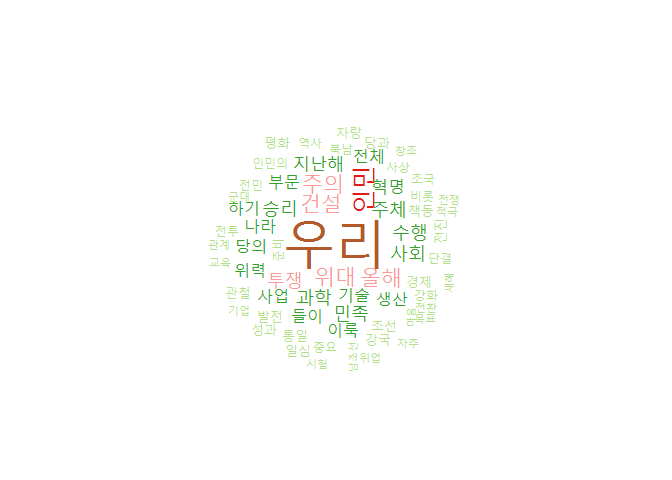

Korean Language Demo by Heewon
==============================

-   The New Year's Day Speech is an important document to understand their plans and changes in goals. By comparing these documents with the previous year, you can see the route changes.
-   I will show simple example of `Hangul(Korean)` processing using 2017 North Korea new year speech with [KoNLP](https://CRAN.R-project.org/package=KoNLP).
-   `KoNLP`
    -   POS Tagger and Morphological Analyzer for Korean text based research. It provides tools for corpus linguistics research such as Keystroke converter, Hangul automata, Concordance, and Mutual Information. It also provides a convenient interface for users to apply, edit and add morphological dictionary selectively.

install necessary packages
--------------------------

``` r
install.packages(pkgs = c("Ruchardet", "KoNLP", "tm", "wordcloud", "stringi"))
```

pre-processing
--------------

-   remove unnecessary part(like blank lines)
-   unicode normalization

``` r
library(Ruchardet)
library(stringi)

#euc-kr
nkor_2017_enc <- detectFileEncoding("NK_speech.txt")

nkor_2017 <- readLines("NK_speech.txt", encoding=nkor_2017_enc)

head(nkor_2017, n=3)
#> [1] "『친애하는 동지들！"                                                                                                                                                                                                                                                                                                                                                                                                                                                                    
#> [2] ""                                                                                                                                                                                                                                                                                                                                                                                                                                                                                       
#> [3] "우리는 주체혁명사에 일찌기 없었던 위대한 번영의 새 역사를 창조하며 하루하루를 격동적인 투쟁의 날과 날로 빛내인 2016년을 보내고 새해 2017년을 맞이합니다. 위대한 인민이 안아온 자랑찬 기적의 위대한 한해를 긍지높이 돌이켜보는 뜻깊은 이 자리에서 나는 당과 사상도 뜻도 의지도 하나가 되여 기쁨과 아픔도 함께 나누고 생사운명을 같이하며 역사에 유례없는 만난시련을 웃으며 헤쳐온 전체 조선인민에게 가장 숭엄한 마음으로 뜨거운 인사를 보내며 희망찬 새해의 영광과 축복을 삼가 드립니다."
```

``` r
#removing blank lines
nkor_2017_filtered <- Filter(function(x){
  stri_trim(x) != ""}, 
  nkor_2017)

#unicode normalization 
#stri_trans_nfkc("ㄱㅏㄷㅏ") == "가다"

#NFKC normalization 
nkor_2017_filtered_norm <- stri_trans_nfkc(nkor_2017_filtered)
```

Thematic words(Nouns) extraction using KoNLP
--------------------------------------------

``` r
library(KoNLP)

#use one of Korean morphological dictionary 
useNIADic('woorimalsam')
#> Backup was just finished!
#> 629897 words dictionary was built.

# no need to split sentences =, KoNLP do internally(using  BreakIterator)
#nkor_2017_filtered_norm <- stri_split_boundaries(nkor_2017_filtered_norm, type="sentence")

#extract Nouns 
nkor_2017_nouns <- extractNoun(nkor_2017_filtered_norm)
```

Make wordcloud
--------------

``` r
library(wordcloud)
#> Loading required package: RColorBrewer

nkor_2017_freq <- table(Filter(function(word){nchar(word) > 1}, unlist(nkor_2017_nouns)))

pal <- brewer.pal(12,"Paired")[-1]

wordcloud(names(nkor_2017_freq), freq = nkor_2017_freq, min.freq=5,
          random.order=F, rot.per=.1,colors=pal)
```



similarities between words
--------------------------

-   make `dtm` object
-   calculate distances between words.
-   do hierarchical clustering

``` r
library(tm)
#> Loading required package: NLP

#analyze with only Hangul 
nkor_2017_nouns_han <- sapply(nkor_2017_nouns, function(sent){
  sent[is.hangul(sent) & nchar(sent) > 1]
})


nkor_2017_corp <- Corpus(VectorSource(nkor_2017_nouns_han))

dtm_k_2017 <- TermDocumentMatrix(nkor_2017_corp)

dtm_k_2017_rmsp <- removeSparseTerms(dtm_k_2017, 0.95)


#make distance matrix and plot Hierarchical Clustering
m <-as.matrix(dtm_k_2017_rmsp)
distMatrix <- dist(scale(m))
fit <- hclust(distMatrix)
plot(fit)
rect.hclust(fit,k=10)
```


Comment
-------

-   If you have any feedback or question, please post an issue [here](https://github.com/ropensci/textworkshop17/issues).
